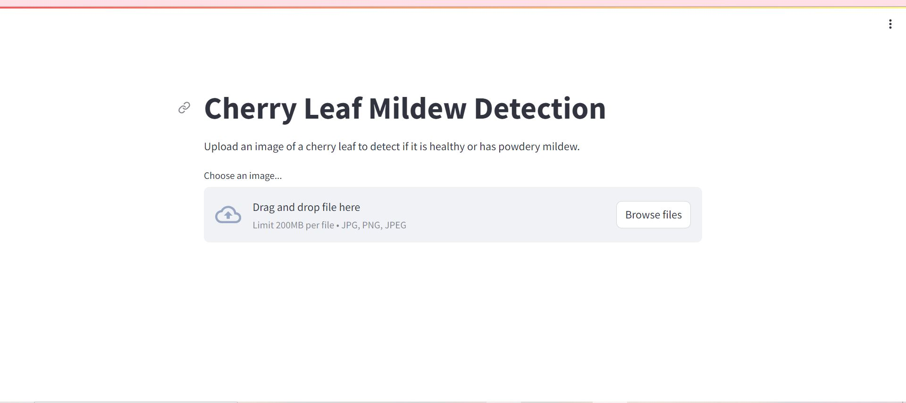

# CHERRY LEAVES PROJECT
###### Deployed Website: [Website Link](https://cherryleavesproject2-254f0c27726c.herokuapp.com/)

## ABOUT
Welcome to the Cherry Leaf Mildew Detection Dashboard, an innovative solution developed to tackle a pressing issue in agricultural disease management. This project, led by Marianne McGuineys, is designed to harness the power of machine learning to streamline the detection of powdery mildew in cherry leaves, significantly enhancing efficiency and accuracy in crop health monitoring.

The primary objective of this project is to automate the detection of powdery mildew—a common and damaging fungal disease affecting cherry trees. Traditionally, the process of identifying and treating this disease has been manual and labor-intensive, requiring significant time and resources. This dashboard revolutionizes this approach by providing a fast, reliable, and scalable method to identify powdery mildew using image analysis.

## UX
The Cherry Leaf Mildew Detection Dashboard is designed to offer a straightforward and effective user experience, making advanced machine learning accessible even to those without technical backgrounds. Simplicity and functionality are at the heart of its design.

* Navigating the dashboard is effortless. The clean and minimalistic interface ensures that users can quickly focus on what matters most—analyzing their cherry leaf images. Upon accessing the dashboard, users are greeted with a clear prompt to upload an image of a cherry leaf. The intuitive drag-and-drop feature or the traditional file upload button make it easy for users to submit their images.

* Once an image is uploaded, the system immediately processes it and displays the results. Within seconds, users receive a clear classification indicating whether the leaf is 'Healthy' or has 'Powdery Mildew', along with a confidence score. This instant feedback is crucial for timely decision-making in agricultural practices.

* The dashboard avoids technical jargon and complex settings. There are no confusing options or unnecessary steps. Users simply upload an image, and the dashboard does the rest. This focus on simplicity ensures that users can concentrate on managing their crops without being overwhelmed by the technology.

* Visual clarity is a key aspect of the dashboard's effectiveness. The uploaded image is prominently displayed, allowing users to see exactly what is being analyzed. The results are presented in a bold and straightforward manner, making it easy to understand the condition of the leaf at a glance.

### Target Audience 
The Cherry Leaf Mildew Detection Dashboard is designed to serve a diverse range of users involved in the agricultural sector, from small-scale farmers to large agribusinesses, as well as agricultural researchers and educators. This tool is invaluable for anyone invested in the health and productivity of cherry crops and potentially other crops in the future.

1. Farmers and Agricultural Workers:
* Small-Scale Farmers: Those managing small or family-owned cherry farms will find this tool particularly useful for maintaining crop health without the need for extensive manual inspections. The dashboard provides a quick, reliable method to monitor and manage powdery mildew, helping to protect their livelihood with minimal investment in time and resources.
* Large-Scale Producers: Agribusinesses with expansive cherry orchards can leverage the dashboard to efficiently oversee their plantations. This tool enables them to implement a scalable solution for disease detection, significantly reducing the labor and time required for monitoring large numbers of trees.

2. Agricultural Consultants and Crop Advisors:
* Professionals who advise farmers on crop management can use this dashboard as a diagnostic tool to provide timely and accurate recommendations for disease treatment. It enhances their ability to support their clients with precise and actionable insights into crop health.

3. Researchers and Academics:
* Agricultural Researchers: Those studying plant diseases and their impact on crops can utilize the dashboard as part of their research toolkit. It offers a practical application for testing hypotheses and collecting data on powdery mildew prevalence and management strategies.
* Educational Institutions: Universities and colleges with agricultural programs can incorporate this tool into their curriculum, providing students with hands-on experience in using technology to solve real-world agricultural challenges.

4. Technology Enthusiasts and Innovators in Agriculture:
* Individuals and companies interested in the intersection of technology and agriculture will find this project a compelling example of how machine learning can be applied to practical problems in farming. It serves as a model for integrating AI into traditional agricultural practices.

### User Stories 
